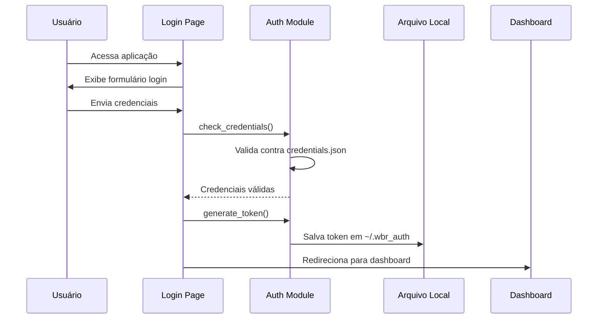
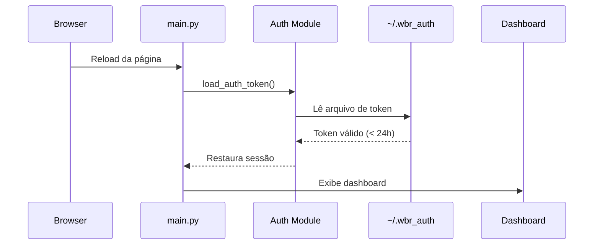
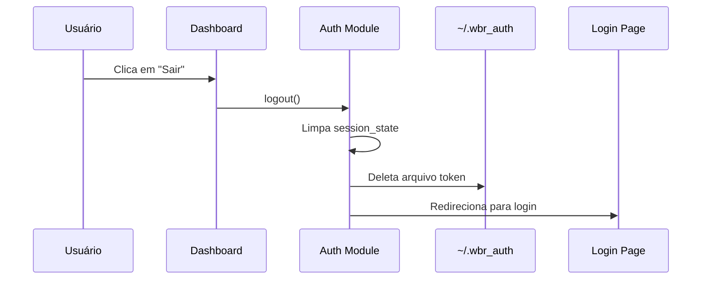

# Sistema de Autenticação - WBR Dashboard

## 📋 Visão Geral

O sistema de autenticação do WBR Dashboard foi implementado de forma modular e simples, adequado para uso em desenvolvimento e ambientes controlados. A autenticação persiste entre recarregamentos de página usando armazenamento local.

## 🏗️ Arquitetura

### Estrutura de Arquivos

```
src/
├── auth/                       # Módulo de autenticação
│   ├── __init__.py            # Exports do módulo
│   └── credentials.py         # Lógica de autenticação
├── ui/
│   └── login.py               # Interface de login
└── main.py                    # Ponto de entrada com verificação de auth
```

### Arquivo de Credenciais

```
credentials.json               # Usuários e senhas (ignorado pelo git)
```

## 🔐 Fluxo de Autenticação

### 1. Login Inicial



### 2. Persistência (Reload/F5)



### 3. Logout



## 💾 Armazenamento de Credenciais

### credentials.json

Localização: `./credentials.json` (raiz do projeto)

```json
{
  "users": [
    {
      "username": "admin",
      "password": "admin123"
    },
    {
      "username": "usuario1",
      "password": "senha123"
    }
  ]
}
```

**⚠️ IMPORTANTE:**
- Este arquivo está no `.gitignore`
- Senhas em texto plano (adequado apenas para desenvolvimento)
- Para produção, use hash de senhas (bcrypt, argon2, etc.)

## 🔑 Geração e Validação de Token

### Estrutura do Token

```python
# Composição do token
token_string = f"{username}:{random_hex}:{timestamp}"
token = sha256(token_string)
```

### Arquivo de Persistência

Localização: `~/.wbr_auth`

```json
{
  "username": "admin",
  "token": "7d865e959b2466918c9863afca942d0fb89d7c9ac0c99bafc3749504ded97730",
  "timestamp": 1698765432.123
}
```

### Validade

- **Duração**: 24 horas (86400 segundos)
- **Verificação**: A cada reload, verifica se `timestamp + 86400 > now()`
- **Expirado**: Arquivo é deletado automaticamente

## 🛠️ Componentes Principais

### src/auth/credentials.py

```python
# Funções principais
load_credentials()      # Carrega usuários do JSON
check_credentials()     # Valida username/password
generate_token()        # Cria token SHA256
save_auth_token()      # Salva em ~/.wbr_auth
load_auth_token()      # Restaura token salvo
clear_auth_token()     # Remove arquivo de token
logout()               # Limpa sessão completa
```

### src/ui/login.py

```python
show_login_page()      # Renderiza formulário de login
                      # Processa tentativas de login
                      # Salva token em caso de sucesso
```

### src/main.py

```python
# Verificação de autenticação
if "authenticated" not in st.session_state:
    auth_data = load_auth_token()  # Tenta restaurar
    if auth_data:
        # Restaura sessão
    else:
        show_login_page()  # Exige login
```

## 🔒 Segurança

### Pontos Fortes

✅ Token com hash SHA256
✅ Expiração automática (24h)
✅ Arquivo local com permissões do usuário
✅ Token único por sessão
✅ Fácil de implementar e manter

### Limitações Atuais

⚠️ Senhas em texto plano no JSON
⚠️ Token não é validado contra servidor
⚠️ Sem refresh token
⚠️ Arquivo local pode ser copiado
⚠️ Não adequado para múltiplos servidores

## 🚀 Melhorias para Produção

### 1. Senhas com Hash

```python
# Usar bcrypt ou argon2
import bcrypt

# No momento de criar usuário
hashed = bcrypt.hashpw(password.encode('utf-8'), bcrypt.gensalt())

# Na validação
bcrypt.checkpw(password.encode('utf-8'), hashed)
```

### 2. JWT Tokens

```python
import jwt
from datetime import datetime, timedelta

# Gerar token
payload = {
    'username': username,
    'exp': datetime.utcnow() + timedelta(hours=24),
    'iat': datetime.utcnow()
}
token = jwt.encode(payload, SECRET_KEY, algorithm='HS256')

# Validar token
try:
    payload = jwt.decode(token, SECRET_KEY, algorithms=['HS256'])
    username = payload['username']
except jwt.ExpiredSignatureError:
    # Token expirado
except jwt.InvalidTokenError:
    # Token inválido
```

### 3. Banco de Dados para Sessões

```sql
-- Tabela de sessões
CREATE TABLE user_sessions (
    id UUID PRIMARY KEY,
    username VARCHAR(100),
    token VARCHAR(255),
    created_at TIMESTAMP,
    expires_at TIMESTAMP,
    ip_address VARCHAR(45)
);
```

### 4. OAuth2/SAML

Para ambientes corporativos, integrar com provedores de identidade:
- Google OAuth
- Microsoft Azure AD
- Okta
- Auth0

## 📝 Como Usar

### Adicionar Novo Usuário

1. Editar `credentials.json`:
```json
{
  "users": [
    {
      "username": "novousuario",
      "password": "senhasegura"
    }
  ]
}
```

### Alterar Duração da Sessão

Em `src/auth/credentials.py`:
```python
# Linha 117 - alterar 86400 (24h) para outro valor
if time.time() - auth_data.get("timestamp", 0) > 86400:
```

### Desabilitar Persistência

Remover as linhas de `save_auth_token()` e `load_auth_token()` para ter sessão apenas em memória.

## 🧪 Testes

### Login Manual
1. Execute: `streamlit run src/main.py`
2. Acesse: `http://localhost:8501`
3. Login com: admin/admin123
4. Teste F5 - deve manter logado
5. Clique em "Sair" - deve deslogar

### Verificar Token Salvo
```bash
# Ver conteúdo do token
cat ~/.wbr_auth

# Verificar se existe
ls -la ~/.wbr_auth
```

### Limpar Token Manual
```bash
rm ~/.wbr_auth
```

## 🔧 Troubleshooting

### Problema: Login não persiste

**Solução**: Verificar permissões para criar arquivo em `~/.wbr_auth`

### Problema: Token não expira

**Solução**: Verificar timezone do servidor e timestamp no arquivo

### Problema: Múltiplos usuários mesmo computador

**Solução**: Usar diretório específico por usuário ou sessões em banco de dados

## 📚 Referências

- [Streamlit Session State](https://docs.streamlit.io/library/api-reference/session-state)
- [Python hashlib](https://docs.python.org/3/library/hashlib.html)
- [Python secrets](https://docs.python.org/3/library/secrets.html)
- [JWT.io](https://jwt.io/)
- [OWASP Authentication Cheat Sheet](https://cheatsheetseries.owasp.org/cheatsheets/Authentication_Cheat_Sheet.html)